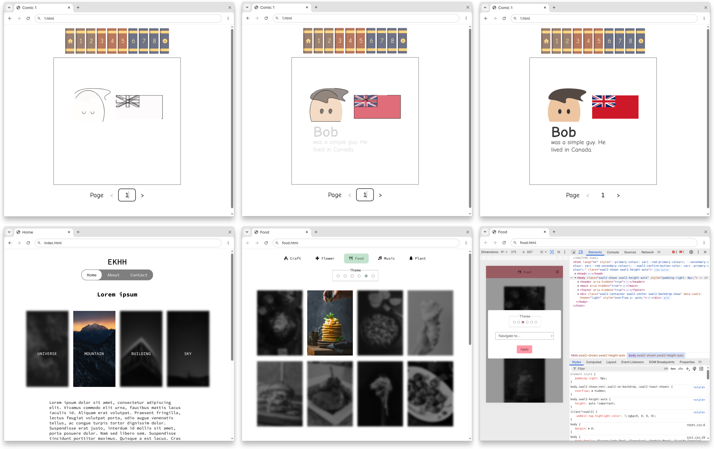

**Deprecated:** PrjComic was a viewer for animated vector graphic comics. It was completed in part as a school assignment in Grade 11.

The main project is available in the `gh-pages` branch; practice projects are available in the `legacy` directory. To test these projects, host them on a local web server.

___

 

	
	<h3>PrjComic</h3>
	
A simple website for viewing vector graphic comics.

	 

## License

Copyright (c) 2025, EKHH (https://github.com/ekhh/prjcomic).

This program is free software: you can redistribute it and/or modify it under the terms of the GNU General Public License as published by the Free Software Foundation, either version 3 of the License, or (at your option) any later version.

This program is distributed in the hope that it will be useful, but WITHOUT ANY WARRANTY; without even the implied warranty of MERCHANTABILITY or FITNESS FOR A PARTICULAR PURPOSE. See the GNU General Public License for more details.

You should have received a copy of the GNU General Public License along with this program. If not, see <https://www.gnu.org/licenses/>.
